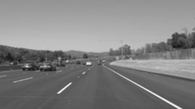

# **Finding Lane Lines on the Road** 

---

## Project Goals

**Finding Lane Lines on the Road**

The goals / steps of this project are the following:

* Create a pipeline that finds lane lines on the road
* Document the project in this writeup
	* Describe pipeline
	* Identify shortcomings
	* Suggest possible improvements

[//]: # (Image References)

[gray_avg]: ./writeup_images/gray_rgb_avg.png "RGB average"

---

## Reflection

### 1. Lane finding pipeline

The pipeline consists of the following steps:

* Convert RGB image to grayscale by averaging the RGB values. However in the challenge video the channel average had very little information to identify the yellow line so in that case the **B** channel was extracted.

* Gaussian blur applied to the grayscale image to remove noise.

* Egdes are detected using the Canny edge detector.

* The lane is masked using a polygon.

* Line segments are detected using Hough transform.

;

* The line segments are voted on in an index accumulator based on their slope (**m** parameter of y=mx*b formula). The peaks for positive and negative slopes are identified to find the left and right groups of lines. Line segment outside of a certain range are discarded and the left and right slopes are averaged.

* The calculated averaged slope left and righ lines drawn.

Based on what I learned in this section, I created a pipeline
My pipeline consisted of 5 steps. First, I converted the images to grayscale, then I .... 

In order to draw a single line on the left and right lanes, I modified the draw_lines() function by ...

If you'd like to include images to show how the pipeline works, here is how to include an image: 

### 2. Identify potential shortcomings with your current pipeline

One potential shortcoming would be what would happen when ... 

Another shortcoming could be ...

### 3. Suggest possible improvements to your pipeline

A possible improvement would be to ...

Another potential improvement could be to ...