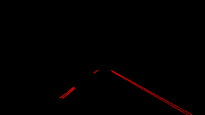

# **Finding Lane Lines on the Road** 

---

## Project Goals

**Finding Lane Lines on the Road**

The goals / steps of this project are the following:

* Create a pipeline that finds lane lines on the road
* Document the project in this writeup
	* Describe pipeline
	* Identify shortcomings
	* Suggest possible improvements

[//]: # (Image References)

[gray_avg]: ./writeup_images/gray_rgb_avg.png "RGB average"

---

## Reflection

### 1. Lane finding pipeline

The pipeline consists of the following steps:

* Convert RGB image to grayscale by averaging the RGB values. In the challenge video the channel average had very little information to identify the yellow line so in that case the **B** channel was extracted.

* Gaussian blur applied to the grayscale image to remove noise.

* Egdes are detected using the Canny edge detector.

* The lane is masked using a polygon.

* Line segments are detected using Hough transform.

;

* The line segments are voted on in an index accumulator based on their slope (**m** parameter of y=mx*b formula). The peaks for positive and negative slopes are identified to find the left and right groups of lines. Line segment outside of a certain range are discarded and the left and right slopes are averaged.

* The calculated averaged slope left and righ lines drawn.

* Videos are processed frame by frame. The lane lines are averaged over time to smooth the output.

---

### 2. Shortcoming of current pipeline

The current pipeline has been tested on a very small set of images/videos. 

The parameters for the algorithms are hard coded so images are taken in a different environment, lane detection would fail. Examples of environment changes:

* different camera setup (polygon mask would not fit the point of interest)
* lighting change (images taken at night would require different thresholds)

There is no error reporting. If the lanes are not found, a warning should be given.

The averaged line is drawn as a first degree polynomial. This is not useful to predict turns coming up.

---

### 3. Suggestions to improve pipeline

* Analyze the images to find point of interest so the polygon mask could be created to match the actual view.
* Adjust edge and line finding algorithms based on ligting conditions.
* Test different color spaces/channels to generate the grayscale image. This could improve edge detection.
* Use uncompressed images to avoid JPEG/MPEG compression artifacts.
* Fit a higher level polynomial on the lane lines.
* Test a median filter instead of gaussian blur. The median filter could filter noise without destroying edges, possibly improving edge detection.
* Refactor code ;)

